DLUHC cookbook for R graphics
================
Last updated: 2023-02-02

<!-- README.md is generated from README.Rmd. Please edit that file -->

## Credit to BBC data team

This cookbook has been copied from the much better BBC rcookbook, and
reapplied to work for creating graphics in a DLUHC style. Credit must go
to the BBC data team for their fantastic product which the team at DLUHC
have essentially copied for our own use.

## How to create DLUHC style graphics

We have developed an R package and an R cookbook to make the process of
creating publication-ready graphics in our in-house style using R’s
ggplot2 library a more reproducible process, as well as making it easier
for people new to R to create graphics.

The cookbook below should hopefully help anyone who wants to make graphs
or maps quickly in a consistent DLUHC style

We’ll get to how you can put together the various elements of these
graphics, but **let’s get the admin out of the way first…**

### Load all the libraries you need

A few of the steps in this cookbook - and to create charts in R in
general - require certain packages to be installed and loaded. So that
you do not have to install and load them one by one, you can use the
`p_load` function in the `pacman` package to load them all at once with
the following code.

``` r
#This line of code installs the pacman page if you do not have it installed - if you do, it simply loads the package
if(!require(pacman))install.packages("pacman")

pacman::p_load('dplyr', 'tidyr', 'gapminder',
               'ggplot2',  'ggalt', 'cowplot', 'sf',
               'forcats', 'R.utils', 'png', 
               'grid', 'ggpubr', 'scales',
               'dluhctheme')
```

### Install the dluhctheme package

`dluhctheme` is not on CRAN, so you will have to install it directly
from Github using `devtools`.

If you do not have the `devtools` package installed, you will have to
run the first line in the code below as well.

``` r
# install.packages('devtools')
devtools::install_github('communitiesuk/dluhctheme')
```

For more info on `dluhctheme` check out the [package’s Github
repo](https://github.com/communitiesuk/dluhctheme), but most of the
details about how to use the package and its functions are detailed
below.

When you have downloaded the package and successfully installed it you
are good to go and create charts.

### How does the dluctheme package work?

The package has two types of functions; Generic functions:
`dluhc_style()` and `finalise_plot()` are functions which are designed
to be generic themes which can be added to any ggplot2 object. They only
edit the axes and the gridlines and define the text style, they do not
set the colour of lines or fill on the graphs. Specific functions: The
other functions are used as a quick tool for instantly creating a
particular type of formatted graph based on a set shape of data
inputted. These are less adaptable, but allow a user to create a graph
in one line of code: `one_line_timeseries()`, `two_line_timeseries()`,
`facet_highlight_timeseries()`, `LA_map()`, `facet_barchart()`,
`forecast_timeseries()` These functions allow you to create a data
visualisation in a set theme instantly but are more fixed in some of
their formatting. Examples of these functions can all be found later in
this document

### Style function

`dluhc_style()`:is added to the ggplot ‘chain’ after you have created a
plot and has one argument for text size. What it does is generally makes
text size, font and colour, axis lines, axis text, margins and many
other standard chart components into DLUHC style, which has been mainly
copied from the BBC data team with some slight tweaks based on the best
practise suggestions by the Analysis Function and ONS.

Note that colours for lines in the case of a line chart or bars for a
bar chart, do not come out of the box from the `dluhc_style()` function,
but need to be explicitly set in your other standard `ggplot` chart
functions.

The code below shows how the `dluhc_style()` should be used within
standard chart-production workflow. This is an example for a very simple
line chart, using data which is contained within the `dluhctheme`
package.

``` r
#Data for chart from 2021 Social Housing Sales statistical release is contained within the dluhctheme package

kable(head(Social_Housing_Sales))
```

| year       | type             | count |
|:-----------|:-----------------|------:|
| 31/03/2008 | Right to Buy     | 15362 |
| 31/03/2008 | Shared Ownership |  2231 |
| 31/03/2009 | Right to Buy     |  3882 |
| 31/03/2009 | Shared Ownership |  1162 |
| 31/03/2010 | Right to Buy     |  3144 |
| 31/03/2010 | Shared Ownership |  1851 |

``` r
#The date column is not in the proper R format, so needs to be converted using the function below
line_df <- Social_Housing_Sales %>%
  mutate(date = as.Date(year,tryFormats = "%d/%m/%Y"))

#Make plot
linegraph <- ggplot(line_df, aes(x = date, y = count)) +
  geom_line(aes(colour = type),size = 1) 
```

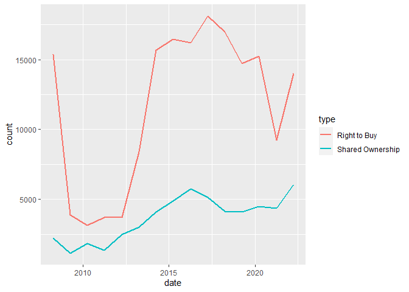<!-- -->

A single line can be added at the end of the script, like below, to make
the graph, *but NOT the line colours* have a generic dluhc style

``` r
styled_line <- linegraph +
dluhc_style()
```

By adding the dluhc style, the grap will change to look like this

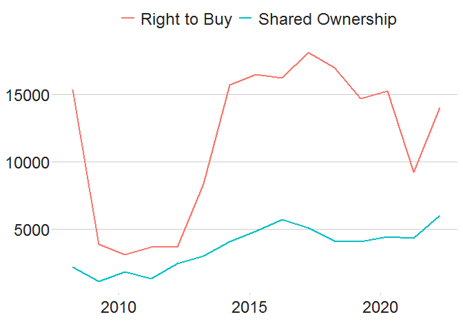<!-- -->

Here is what the `dluhc_style ()` function actually does under the
bonnet. It essentially modifies certain arguments in the `theme`
function of `ggplot2`.

For example, the first argument is setting the font, size, typeface and
colour of the title element of the plot.

    ## function (size = 2) 
    ## {
    ##     ggplot2::theme(plot.title = ggplot2::element_text(size = size * 
    ##         11, face = "bold"), plot.subtitle = ggplot2::element_text(size = size * 
    ##         9), plot.caption = ggplot2::element_blank(), legend.position = "top", 
    ##         legend.text.align = 0, legend.background = ggplot2::element_blank(), 
    ##         legend.title = ggplot2::element_blank(), legend.key = ggplot2::element_blank(), 
    ##         legend.text = ggplot2::element_text(size = size * 9, 
    ##             color = "#222222"), axis.title = ggplot2::element_blank(), 
    ##         axis.text = ggplot2::element_text(size = size * 9, color = "#222222"), 
    ##         axis.text.x = ggplot2::element_text(margin = ggplot2::margin(5, 
    ##             b = 10)), axis.ticks = ggplot2::element_line(color = "#cbcbcb"), 
    ##         axis.line = ggplot2::element_blank(), panel.grid.minor = ggplot2::element_blank(), 
    ##         panel.grid.major.y = ggplot2::element_line(color = "#cbcbcb"), 
    ##         panel.grid.major.x = ggplot2::element_blank(), panel.background = ggplot2::element_blank(), 
    ##         strip.background = ggplot2::element_rect(fill = "white"), 
    ##         strip.text = ggplot2::element_text(size = size * 11, 
    ##             hjust = 0))
    ## }
    ## <bytecode: 0x14ed83a8>
    ## <environment: namespace:dluhctheme>

You can modify these settings for your chart, or add additional theme
arguments, by calling the `theme` function with the arguments you want -
but please note that for it to work you must call it *after* you have
called the `dluhc_style` function. Otherwise `dluhc_style()` will
override it.

This will add some gridlines, by adding extra theme arguments to what is
included in the `dluhc_style()` function. There are many similar
examples throughout the cookbook.

``` r
theme(panel.grid.major.x = element_line(color="#cbcbcb"), 
        panel.grid.major.y=element_blank())
```

### Save out your finished chart

After adding the `dluhc_style()` to your chart there is one more step to
get your plot ready for publication. `finalise_plot()`, the second
function of the `dluhctheme` package, will left-align the title,
subtitle and add the footer with a source and an image in the bottom
right corner of your plot. It will also save it to your specified
location. The function has five arguments:

Here are the function arguments:
`finalise_plot(plot_name, source, save_filepath, width_pixels = 640, height_pixels = 450, logo_image_path)`

-   `plot_name`: the variable name that you have called your plot, for
    example for the chart example above `plot_name` would be
    `"styled_line"`  
-   `source`: the source text that you want to appear at the bottom left
    corner of your plot. You will need to type the word `"Source:"`
    before it, so for example `source = "Source: ONS"` would be the
    right way to do that.
-   `save_filepath`: the precise filepath that you want your graphic to
    save to, including the `.png` extension at the end. This does depend
    on your working directory and if you are in a specific R project. An
    example filepath would be:
    `Desktop/R_projects/charts/line_chart.png`.
-   `width_pixels`: this is set to 640px by default, so only call this
    argument if you want the chart to have a different width, and
    specify what you want it to be.
-   `height_pixels`: this is set to 450px by default, so only call this
    argument if you want the chart to have a different height, and
    specify what you want it to be.
-   `logo_image_path`: this argument specifies the path for the
    image/logo in the bottom right corner of the plot. The default is
    for a placeholder PNG file with a background that matches the
    background colour of the plot, so do not specify the argument if you
    want it to appear without a logo. If you want to add your own logo,
    just specify the path to your PNG file. The package has been
    prepared with a wide and thin image in mind.

Example of how the `finalise_plot()` is used in a standard workflow.
This function is called once you have created and finalised your chart
data, titles and added the `dluhc_style()` to it:

``` r
finalise_plot(plot_name = my_line_plot,
              source = "Source: Example source",
              save_filepath = "filename_that_my_plot_should_be_saved_to.png",
              width_pixels = 640,
              height_pixels = 450,
              logo_image_path = "placeholder.png")
```

So once you have created your plot and are relatively happy with it, you
can use the `finalise_plot()` function to make the final adjustments and
save out your chart so that you can look at it outside RStudio.

It is important to mention that it is a good idea to do this early on
because the position of the text and other elements do not render
accurately in the RStudio Plots panel because this depends on the size
and aspect ratio you want your plot to appear, so saving it out and
opening up the files give you an accurate representation of how the
graphic looks. If you are working on graphs which will go onto a gov.uk
page, these need to be svg files with pixels of 640 x 640.

The finalise_plot() function does more than just save out your chart, it
also left-aligns the title and subtitle, adds a footer with the logo on
the right side and lets you input source text on the left side.

So how can you save out the example plot created above?

``` r
finalise_plot(plot_name = styled_line,
              source = " Source: Social Housing Sales 2021, DLUHC ",
              save_filepath = "images/line_plot_finalised_test.png",
              width_pixels = 640,
              height_pixels = 550)
```

## Make a line chart

### Single line chart

The data we are going to use for these examples is the
`Social_Housing_Sales` dataset contained within the dluhctheme package.

This dataset has two types of sale, Right to Buy and Shared Ownership,
and has the year in the format “31/03/2021”, which in R is referred to
as `"%d/%m/%Y"`. To see more about date formats, see the section at the
end of this document.

``` r
#Prepare data, select only Right to Buy sales and clean the date column
RTB_Sales <- Social_Housing_Sales %>% 
  filter(type=="Right to Buy") %>% 
  mutate(date = as.Date(year,tryFormats = "%d/%m/%Y"))


#Make plot, a line graph with the union blue colour (#012169)
line <- ggplot(RTB_Sales, aes(x = date, y = count)) +
  geom_line(colour = "#012169", linewidth = 1) +
  dluhc_style() 
```

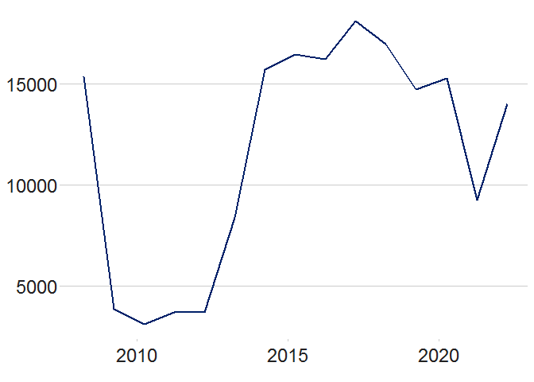<!-- -->

### dluhctheme function

If you want to create a graph with one line, plotting a variable against
time, in a consistent DLUHC style, you can use the
`one_line_timeseries()` function within the `dluhctheme` package. This
function negates the need for writing any of the ggplot code and
instantly takes your data from a dataframe and puts it into a graph.

``` r
RtB_graph <- one_line_timeseries(.data = RTB_Sales,
                    ycol = count, 
                    datecol = year, 
                    dateformat = "%d/%m/%Y")
```

-   `.data` is the name of the dataframe you are using. It must contain
    at least a value column (as a numeric) and a date column (in a
    format you can define)
-   `datecol` is the name of the column in your dataframe which contains
    the date variable. You do *not* need to give this column name in
    quotations marks
-   `ycol` is the name of the column in your dataframe which contains
    the numeric variables. If the column is not numeric, the function
    will return an error message
-   `dateformat` is the format which your date is written in. It has a
    default of “%Y-%m-%d”, which is a date written in the format of
    “2021-02-25”. If your date is in the format 25/02/2021, you would
    write “%d/%m/%Y” for this variable. For more details on date format,
    see the table at the bottom of this document

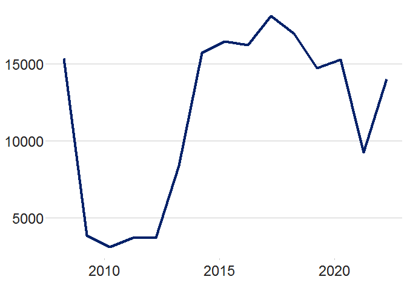<!-- -->

You can further add changes if you don’t like them, such as the
placement of the y axis, using the `scale_y_continuous` function

``` r
RtB_graph +
  scale_y_continuous(limits = c(0,20000))
```

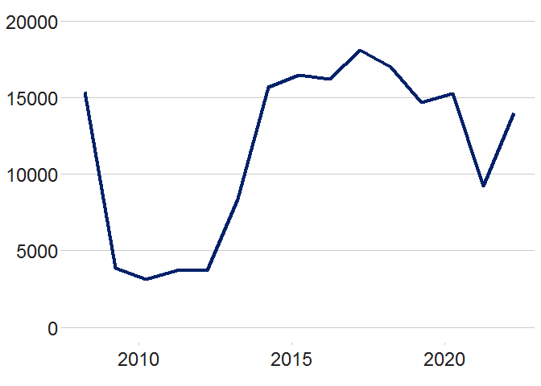<!-- -->

### Multiple line chart

It is suggested that for line graphs with multiple lines, you try to
limit the number of lines on a single graph to make reading the data
easier. Guidance from ONS suggests no more than 5 lines on a single
graph. The below example plots 2 lines on a chart

``` r
#See what the data looks like
two_line_df <- Social_Housing_Sales %>%
  mutate(date = as.Date(year,tryFormats = "%d/%m/%Y"))

#Make plot
multiple_line <- ggplot(two_line_df, aes(x = date, y = count, colour = type)) +
  geom_line(linewidth = 1) +
  scale_colour_manual(values = c("#012169", "orange")) +
  dluhc_style() 
```

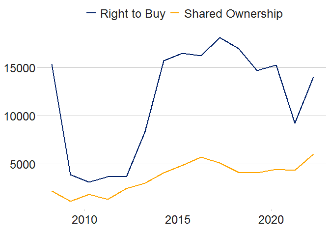<!-- -->

The `scale_color_manual` function sets the two colours of the lines. As
can be seen in the text it can use both the hex-code (#012169 is the hex
code for DLUHC union blue) as well as words (“orange”) which are saved
in the function as colours.

The “DLUHC colours” for a multi-line time series are contained within a
function in the dluhctheme package: `multi_line_timeseries`

### dluhctheme function

``` r
multi_line_timeseries(.data = Social_Housing_Sales,
                      datecol = year, 
                      ycol = count, 
                      groupcol = type, 
                      dateformat = "%d/%m/%Y")
```

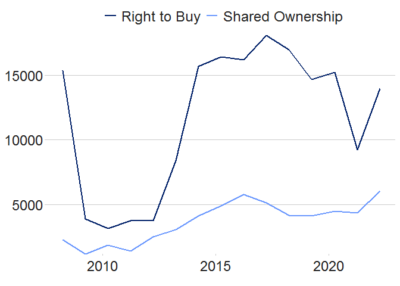<!-- -->

This function works identically to the one_line_timeseries function with
the addition of the `groupcol` variable which is the variable to denote
how the data is split.

To use this function, your data must be in the same format as the
`Social_Housing_Sales` dataset, with one column for the date, one for
the numeric value and one for the category variable.

This function sets up to five different colours for a line chart. If you
want to use more than 5 colours, it is suggested that you break the
graphs up into separate facets and use a function like the one below:

### Using facets

Faceting is a method used to separate categorical variables and plot on
multiple separate graphs. The data contained within the
`Net_Additions_Regional` dataset creates one time series for each of the
nine regions in England. Below shows it plotted on one graph:

``` r
kable(head(Net_Additions_Regional))
```

| Year       | Region                   | Net_Additions |
|:-----------|:-------------------------|--------------:|
| 31/03/2001 | North East               |          2890 |
| 31/03/2001 | North West               |         10720 |
| 31/03/2001 | Yorkshire and The Humber |         10800 |
| 31/03/2001 | East Midlands            |         14830 |
| 31/03/2001 | West Midlands            |         13790 |
| 31/03/2001 | East of England          |         17780 |

To plot on a graph, the date column needs to be cleaned:

``` r
Cleaned_data <- mutate(Net_Additions_Regional, date = as.Date(Year,tryFormats = "%d/%m/%Y"))

NetAdd_graph <- Cleaned_data %>%
  ggplot(aes(x = date, y = Net_Additions, groups = Region)) +
  geom_line(aes(colour = Region)) +
  dluhc_style()

NetAdd_graph
```

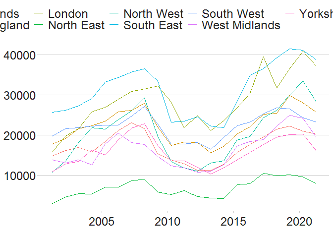<!-- -->

As you can see, the graph above is very messy and difficult to follow
each region individually easily. One option is to facet the graphs by
region, using the `facet_wrap` function:

``` r
NetAdd_graph <- Cleaned_data %>%
ggplot(aes(x = date, y = Net_Additions, groups = Region)) +
geom_line() +
facet_wrap(~Region,scales="fixed") +
dluhc_style(size = 1)

NetAdd_graph
```

<!-- -->

The `dluhc_style` function has a size variable which is useful to set to
1 for a faceted time series, as it looks quite busy if the text size is
set to the same as it would otherwise be on a normal time series.

The facet_wrap function is made of 2 parts, the first is to separate
which variables the graph is going to be used to break the data up by
(`~Region`), and the second (`scales=`) denotes whether all will be
plotted on the same axis scale (`scales = “fixed”`) or have a free axis
(`scales = “free”`). There are benefits to your graphs for doing either
of these: fixed allows you to compare the regions to one another more
easily but can hide the changes in some regions which have a low
absolute value, while free scales allows you to see the rate of change
in each region, but does not show them compared to one another easily.

### dluhctheme function

There is also a standard function built into the `dluhctheme` package
which allows you to create a highlighted faceted graph in one step, like
the previous functions

``` r
facet_graph <- facet_highlight_timeseries(.data = Net_Additions_Regional,
                                          datecol = Year,
                                          ycol = Net_Additions,
                                          groupcol = Region,
                                          dateformat = "%d/%m/%Y")

facet_graph
```

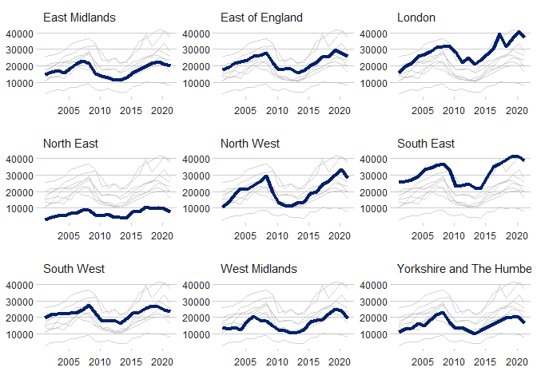<!-- -->

Again this function can be adapted to have the axis match what you may
want from them, for example if you wanted:

-   the axis to go from 0-50000 `limits = c(0,50000)`
-   labels at 0, 25000 and 50000 `breaks = c(0,25000,50000)`
-   labels to have commas in them, using the scales package
    `labels = scales::comma`
-   y-axis to cross the x-axis at 0 `expand = c(0,0)`

``` r
facet_graph +
  scale_y_continuous(breaks = c(0,25000,50000),limits = c(0,50000),labels = scales::comma,expand = c(0,0))
```

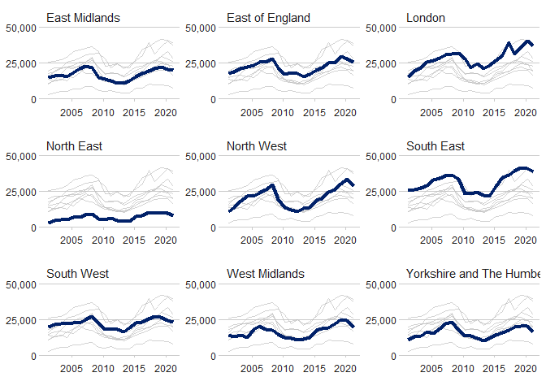<!-- -->

### Creating a forecast time series

Sometimes you may want to present data on a graph of which some of the
data is recorded data and some is a prediction or forecast. There are a
few different ways to achieve this.

The example dataset for this is the `GDP_Deflator` data contained in the
dluhctheme package

``` r
kable(GDP_Deflator)
```

| year       |      GDP |
|:-----------|---------:|
| 31/03/2020 |  94.8652 |
| 31/03/2021 | 100.2213 |
| 31/03/2022 | 100.0000 |
| 31/03/2023 | 102.4102 |
| 31/03/2024 | 104.3092 |
| 31/03/2025 | 106.3465 |
| 31/03/2026 | 108.4740 |

All the data up to 31/03/2022 is recorded data, and all afterwards is
preidiction

The most simple method is to add a dotted line vertically on the graph
to denoe where the predictions begin from.

``` r
#As with the previous examples, the date needs cleaning before running. 
Forecast_df <- GDP_Deflator %>%
  mutate(date = as.Date(year,tryFormats = "%d/%m/%Y"))

Forecast_df %>%
  ggplot(aes(x = date, y=GDP)) +
  geom_line(linewidth = 2,colour="blue") +
  geom_vline(xintercept = as.Date("2022-03-31"),linewidth = 1.5,linetype="dashed") +
  dluhc_style()
```

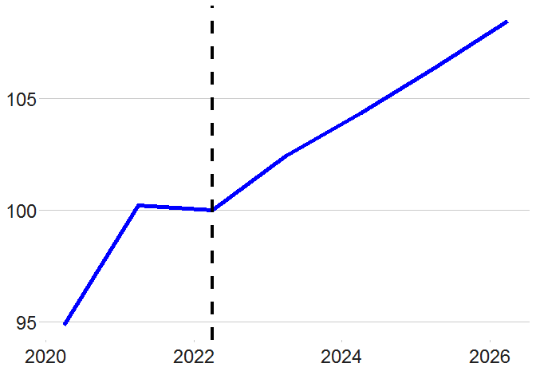<!-- -->

Another method would be to have the lines go from a solid line to a
dashed line. To do this you need to add in a new column as well as
duplicated the row which contains the last recorded value.

``` r
Forecast_df_2 <- Forecast_df %>%
  mutate(type =ifelse(date <= as.Date("2022-03-31"),"Actual","Predicted")) %>%
  add_row(year = "31/03/2022",date = as.Date("2022-03-31"),GDP=100,type = "Predicted") %>%
  arrange(date)

kable(Forecast_df_2)
```

| year       |      GDP | date       | type      |
|:-----------|---------:|:-----------|:----------|
| 31/03/2020 |  94.8652 | 2020-03-31 | Actual    |
| 31/03/2021 | 100.2213 | 2021-03-31 | Actual    |
| 31/03/2022 | 100.0000 | 2022-03-31 | Actual    |
| 31/03/2022 | 100.0000 | 2022-03-31 | Predicted |
| 31/03/2023 | 102.4102 | 2023-03-31 | Predicted |
| 31/03/2024 | 104.3092 | 2024-03-31 | Predicted |
| 31/03/2025 | 106.3465 | 2025-03-31 | Predicted |
| 31/03/2026 | 108.4740 | 2026-03-31 | Predicted |

``` r
Forecast_df_2 %>%
  ggplot(aes(x = date,y=GDP,group=type)) +
  geom_line(aes(linetype = type), linewidth = 1.2, colour = "blue") +
  dluhc_style()
```

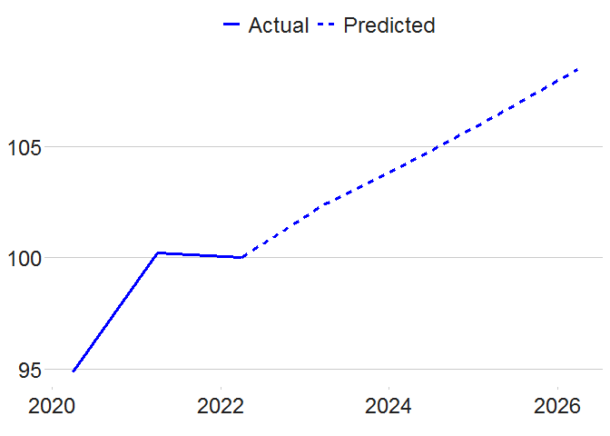<!-- -->

### dluhctheme function

This is quite a long process, so a function has been created which will
do this for you: `forecast_timeseries()`

``` r
forecast_timeseries(.data = GDP_Deflator,
                    datecol = year,
                    ycol = GDP,
                    cutdate = "01/04/2022",
                    dateformat = "%d/%m/%Y",
                    dottedline = TRUE,
                    label_names = c("Recorded","Forecast") )
```

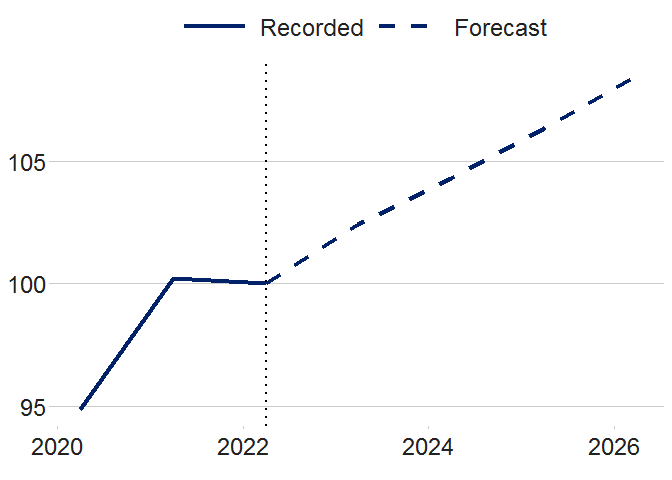<!-- -->

-   `cutdate` is the first day after the last recorded value (1st April
    2022 is after 31st March 2022)
-   `dottedline` is a TRUE/FALSE variable, to whether you want a
    vertical dotted line at the cut date
-   `label_names` are the names given to the two lines

## Make a bar chart

``` r
#Prepare data
bar_df <- gapminder %>%
  filter(year == 2007 & continent == "Africa") %>%
  arrange(desc(lifeExp)) %>%
  head(5)

#Make plot
bars <- ggplot(bar_df, aes(x = country, y = lifeExp)) +
  geom_bar(stat="identity", 
           position="identity", 
           fill="#1380A1") +
  geom_hline(yintercept = 0, size = 1, colour="#333333") +
  dluhc_style() +
  labs(title="Reunion is highest",
       subtitle = "Highest African life expectancy, 2007")
```

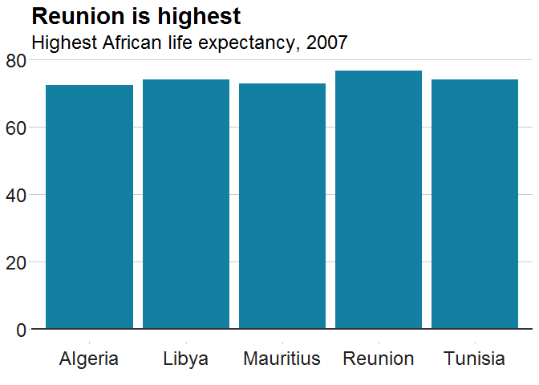<!-- -->

### Stacked bar chart

``` r
#prepare data
stacked_df <- gapminder %>% 
  filter(year == 2007) %>%
  mutate(lifeExpGrouped = cut(lifeExp, 
                    breaks = c(0, 50, 65, 80, 90),
                    labels = c("Under 50", "50-65", "65-80", "80+"))) %>%
  group_by(continent, lifeExpGrouped) %>%
  summarise(continentPop = sum(as.numeric(pop)))

#set order of stacks by changing factor levels
stacked_df$lifeExpGrouped = factor(stacked_df$lifeExpGrouped, levels = rev(levels(stacked_df$lifeExpGrouped)))

#create plot
stacked_bars <- ggplot(data = stacked_df, 
                       aes(x = continent,
                           y = continentPop,
                           fill = lifeExpGrouped)) +
  geom_bar(stat = "identity", 
           position = "fill") +
  dluhc_style() +
  scale_y_continuous(labels = scales::percent) +
  scale_fill_viridis_d(direction = -1) +
  geom_hline(yintercept = 0, size = 1, colour = "#333333") +
  labs(title = "How life expectancy varies",
       subtitle = "% of population by life expectancy band, 2007") +
  theme(legend.position = "top", 
        legend.justification = "left") +
  guides(fill = guide_legend(reverse = TRUE))
```

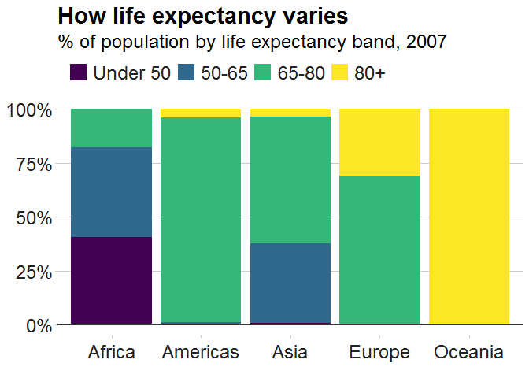<!-- -->

This example shows proportions, but you might want to make a stacked bar
chart showing number values instead - this is easy to change!

The value passed to the `position` argument will determine if your
stacked chart shows proportions or actual values.

`position = "fill"` will draw your stacks as proportions, and
`position = "identity"` will draw number values.

### Grouped bar chart

Making a grouped bar chart is very similar to making a bar chart.

You just need to change `position = "identity"` to `position = "dodge"`,
and set the `fill` aesthetically instead:

``` r
#Prepare data
grouped_bar_df <- gapminder %>%
  filter(year == 1967 | year == 2007) %>%
  select(country, year, lifeExp) %>%
  spread(year, lifeExp) %>%
  mutate(gap = `2007` - `1967`) %>%
  arrange(desc(gap)) %>%
  head(5) %>%
  gather(key = year, 
         value = lifeExp,
         -country,
         -gap) 
  
#Make plot
grouped_bars <- ggplot(grouped_bar_df, 
                       aes(x = country, 
                           y = lifeExp, 
                           fill = as.factor(year))) +
  geom_bar(stat="identity", position="dodge") +
  geom_hline(yintercept = 0, size = 1, colour="#333333") +
  dluhc_style() +
  scale_fill_manual(values = c("#1380A1", "#FAAB18")) +
  labs(title="We're living longer",
       subtitle = "Biggest life expectancy rise, 1967-2007")
```

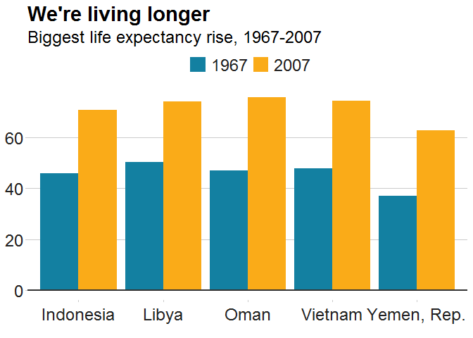<!-- -->

### Faceted bar charts

Using the same data from the stacked bar charts, you can see how the
data could be displayed different through faceting.

``` r
facet_df <- stacked_df %>%
  group_by(continent) %>%
  mutate(Proportion = continentPop/sum(continentPop))

facet_bars <- ggplot(data = facet_df, 
                       aes(x = continent,
                           y = Proportion)) +
  geom_bar(stat = "identity", 
           position = "identity") +
  facet_wrap(~lifeExpGrouped)+
  dluhc_style(size = 1) +
  scale_y_continuous(labels = scales::percent) 

facet_bars
```

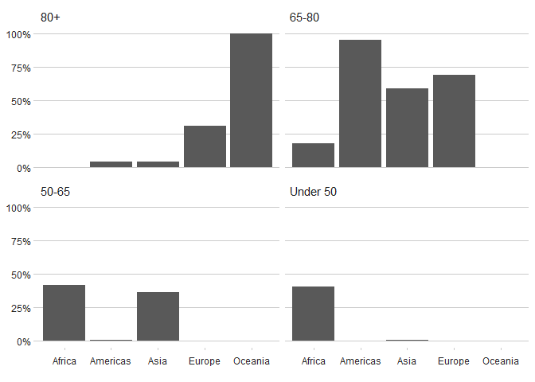<!-- -->

## Static LA Maps

The package also allows you to create maps, currently only at LA level,
using the LA_map function.

To create the map your data must have a column for the LA codes in the
proper ONS format, not that mad loopy format that LPA use!

The example data for this is the number of help to buy sales in each
local authority

``` r
kable(head(Help_to_Buy))
```

| LA_Code   | Completions |
|:----------|------------:|
| E06000022 |      406490 |
| E06000055 |      777743 |
| E06000008 |      178175 |
| E06000009 |           0 |
| E06000028 |           0 |
| E06000058 |           0 |

You need to specify a few things for this function:

-   `.data` is the name of the dataframe
-   `LA_col` is the column which your LA code is in
-   `year` is the financial year which matches your data, so it will
    choose the correct map
-   `map_colours` is a two colour vector which has the low and high
    colour for the scale, as standard this is white and union blue
-   `save` if you set this to true it will save as a png, but you MUST
    specify the path in the filepath part
-   `countries` are the countries you want displayed E, E+W, GB or UK

``` r
HtB_map <- LA_map(.data = Help_to_Buy
       ,LA_col = LA_Code
       ,countries = "E"
       ,variable = Completions
       ,map_colours = c("#FFFFFF","#012169")
      ,year = "2021-22"
      ,save = F)
```

    ## [1] "Your original data had 334 rows of data"
    ## [1] "On the map, there were 309 matches"

<!-- -->
